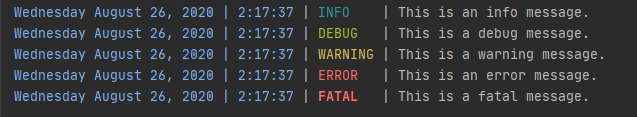

# Simple-Logger

Just a simple logger. Thanks to [Apacheli](https://github.com/Apacheli) for certain ideas.

## Usage

```go
package main

import (
    "fmt"
    "github.com/logrusorgru/aurora/v3"
	log "simple-logger"
)

func main {
    builder := log.ConsoleLoggerBuilder()
    
    // Short way for all the defaults.
    log.SetDefaults(builder, nil, nil, nil)
    
    // Long way 
    builder.AddLevel("INFO", log.Info)
    builder.AddLevel("DEBUG", log.Debug)
    builder.AddLevel("ERROR", log.Error)
    builder.AddLevel("FATAL", log.Fatal)
    builder.AddLevel("WARNING", log.Warning)

    builder.AddPadding(log.TimestampPadding)
    builder.AddPadding(log.LevelPadding)

    builder.AddColumn(func(context log.Context) string {
        layout := fmt.Sprintf("%v %v %v, %v | %v:%v:%v", log.Weekday, log.Month, log.Day, log.Year, log.Hour, log.Minute, log.Second)
        return aurora.BrightBlue(context.FormatTimestamp(layout)).String()
    })
    builder.AddColumn(func(context log.Context) string { return context.FormatLevel() })
    builder.AddColumn(func(context log.Context) string { return context.Message })
    
    logger := builder.Build()

    logger.Log("INFO", "This is an info message.")
    logger.Log("DEBUG", "This is a debug message.")
    logger.Log("WARNING", "This is a warning message.")
    logger.Log("ERROR", "This is an error message.")
    logger.Log("FATAL", "This is a fatal message.")
}
```

Produces 

## Installation

`go get -u github.com/logrusorgru/aurora/v3`